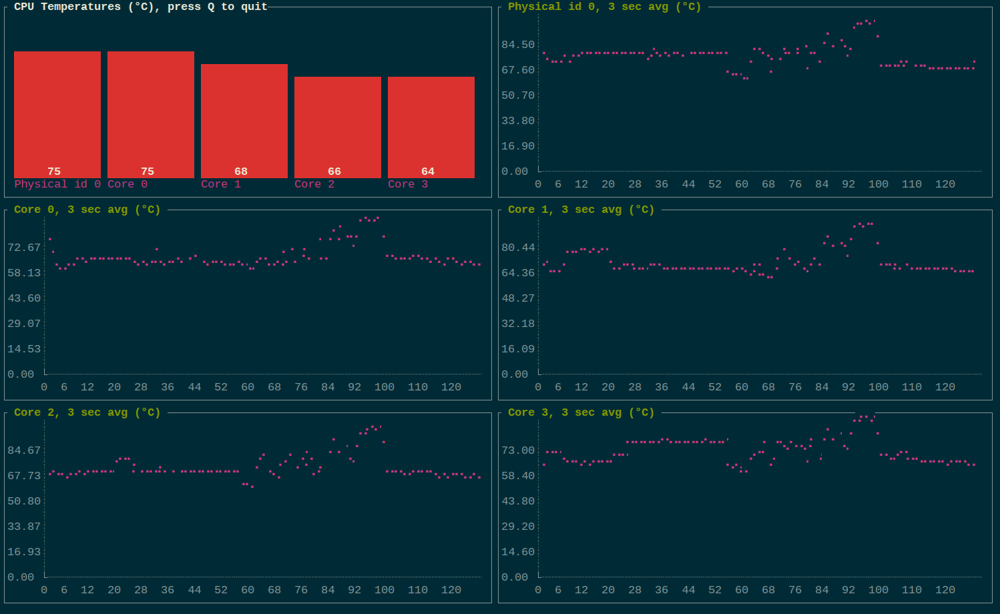

i7tt - CPU Temperature CLI Monitor 
=====================

## Introduction

`i7tt` is a simple utility to show the current CPU temperature(s) and a
historical average in the terminal. It uses the Linux sysfs interface of the
[coretemp](https://www.kernel.org/doc/Documentation/hwmon/coretemp) driver,
thus it should support most Intel processors produced after 2005.

i7tt stands for _i7 terminal temperature_.

## Usage

To run from source:

    $ git clone https://github.com/andmarios/i7tt
    $ cd i7tt
    $ go get -u
    $ go run i7tt.go

You may download a [precompiled binary for x86_64](https://github.com/andmarios/i7tt/releases/download/v1.02/i7tt-v1.02-x86_64.tbz).
For Gentoo users there is an [ebuild available](https://github.com/andmarios/ebuilds_backyard/tree/master/app-admin/i7tt).

If you have set your go correctly, you can install it easily:

    $ go get -u github.com/andmarios/i7tt
    $ i7tt

You may set the average period length (default 30 seconds):

    $ i7tt -a 5

## Colors

i7tt should work nicely with any color scheme with a dark background.

Barchart's color are:

- Green: All sensors report a temperature `< max temperature - 25°C`.
- Yellow: All sensors report a temperature lower than their reported max temperature and at least
one sensor reports a sensor `>= max temperature - 25°C`.
- Red: At least one sensor reports a temperature `> max temperature`.

Max temperature for each sensor is read from sysfs.

## Hacking

Since the sysfs interface of hwmon devices is standard, it should be easy to
add other temperature sensors that expose their information to sysfs via
tweaking the regular expressions that detect the sysfs files. Have a look
to the Linux kernel [hwmon documentation](https://www.kernel.org/doc/Documentation/hwmon/).

Unfortunately I haven't any other hardware to test.
